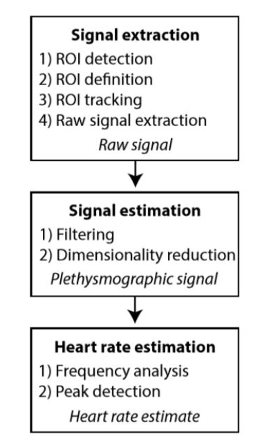
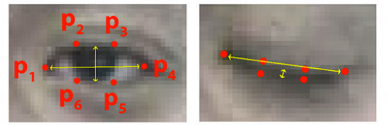
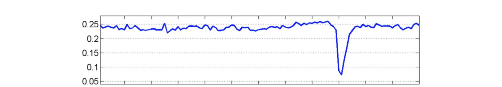
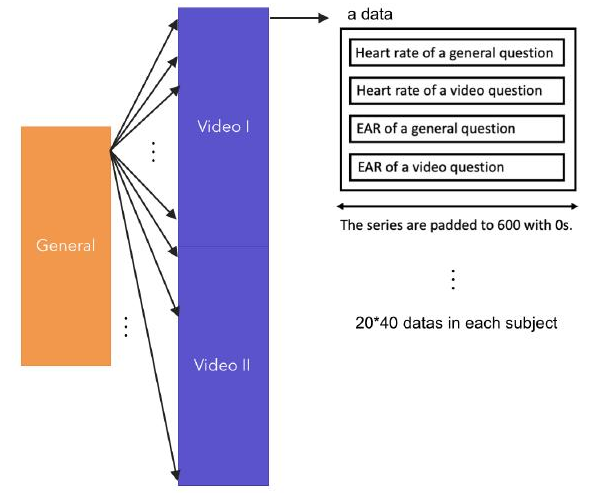
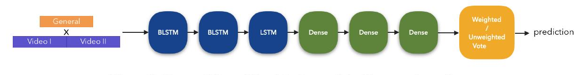
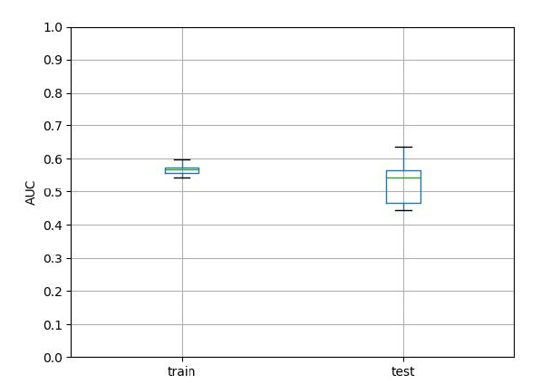
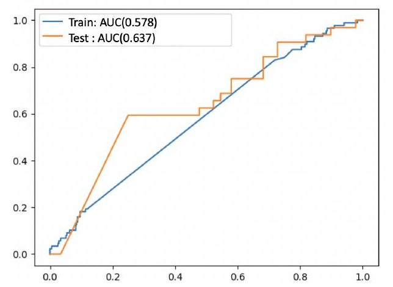

# Camera-Based Non-Contact Lie Detector

**Yu-Peng Hsieh, Zi-Yi Tai, Chien-Chi Hsu**  
BS in Electrical Engineering, National Taiwan University  
Advisor: Pai-Chi Li

---

## Overview

This project proposes a non-contact lie detection system that extracts physiological signals from video alone — no wires, no sensors, no physical contact. Heart rate (via rPPG) and eye blink patterns (via OpenCV) are measured remotely from webcam footage, then fed into an LSTM-based classifier trained to distinguish truth from deception.

Best model performance: **AUC 0.57 / 0.53** (train/test) using participant baseline data.

---

## Motivation

Traditional polygraphs require physical contact (arm cuffs, finger clips) and are vulnerable to intentional interference. A camera-based approach is unobtrusive and harder to game by poor contact. This work explores whether deception signals are recoverable from video without physical sensors.

---

## Methods

### Physiological Signals

**Heart Rate — Remote Photoplethysmography (rPPG)**  
Heart rate is extracted from video by analyzing subtle periodic color changes in facial skin. The green channel carries the strongest plethysmographic signal (hemoglobin absorbs green light most strongly). The pipeline:


*Figure 1: Generalized rPPG algorithm framework.*

1. ROI detection, definition, and tracking on the face
2. Raw RGB signal extraction per frame
3. Bandpass filtering and dimensionality reduction
4. HR estimation via FFT / peak detection

---

**Eye Aspect Ratio (EAR)**  
Blink behavior changes during deception — lying is associated with reduced blink rate during the lie, followed by a compensatory increase afterward. EAR is computed per frame using six facial landmarks:


*Figure 2: The sites of p1 to p6 used to compute EAR.*

$$EAR = \frac{\|p_2 - p_6\| + \|p_3 - p_5\|}{2\|p_1 - p_4\|}$$

EAR stays roughly constant when the eye is open and drops to ~0 during a blink:


*Figure 3: EAR plotted over video frames. A single blink is visible as the sharp dip.*

---

### Data Collection

15 participants watched two crime scene videos and were randomly assigned to either **testify** (answer honestly) or **defend** (lie to exonerate the suspect). Each participant answered 60 questions across three phases:

1. **General questions** — stress-free baseline (e.g., factual knowledge questions), used to establish each participant's resting HR and EAR
2. **Crime video I questions** — 20 questions, participant assigned to testify or lie
3. **Crime video II questions** — 20 questions, participant assigned to the opposite role

Labels were verified with each participant after the session. Dataset breakdown:

| | Truth | Lie |
|---|---|---|
| Total answers | 470 (78.3%) | 130 (21.7%) |

---

### Data Structure

Each sample pairs a general-question recording with a crime-question recording, stacking HR and EAR series into a (4, 600) array — giving the model a per-subject baseline reference:


*Figure 4: Data structure — each crime-related sample is paired with one general-question sample.*

---

### Models

**Baseline (Dummy Classifier)**  
Logistic regression with sigmoid output. Achieves ~75% accuracy by predicting "truth" for every sample — revealing that accuracy alone is a misleading metric on this imbalanced dataset. AUC = 0.50.

**LSTM Classifier — without baseline**  
Architecture: BiLSTM → BiLSTM → LSTM → Dense → Dense → Dense → sigmoid  
Loss: weighted binary cross-entropy (inverse class frequency).


*Figure 5: Workflow of the detector model without general questions.*

**LSTM Classifier — with baseline**  
Each crime-related sample is paired with a general-question sample, giving the model a per-subject reference. Final prediction aggregates 20 votes — either equally or with **differential weighting** for more easily-verified questions.


*Figure 6: Workflow of the detector model with general questions.*

---

## Results

| Model | Train AUC | Test AUC |
|---|---|---|
| Dummy | 0.50 | 0.50 |
| LSTM (no baseline) | 0.51 | 0.49 |
| LSTM + baseline (equal vote) | 0.55 | 0.52 |
| LSTM + baseline (weighted vote) | **0.57** | **0.53** |

**AUC distribution across participant splits:**


*Figure 8: Distribution of AUC on training and testing sets (with general questions).*

**Example ROC curves:**


*Figure 9: Example ROC curves for one participant split.*

---

## Limitations

- Remote physiological measurement is noisy; smoothing and scaling helped but didn't fully resolve this
- Small dataset (15 participants, 600 total responses) limits generalization
- Class imbalance (78% truth): accuracy is a misleading metric; AUC, recall, and F1 used instead
- Participants had little incentive to lie convincingly (no reward/punishment), weakening the deception signal
- Heart rate and related cardiovascular signals are influenced by many factors beyond deception (arousal, anticipation, physical activity), which is the core challenge for all polygraph-style approaches

---

## Future Work

- Improve reliability of rPPG and EAR extraction (better ROI tracking, lighting normalization)
- Design stronger experimental protocols that create real incentive to deceive
- Incorporate additional physiological channels (respiration, skin color changes, micro-expressions)
- Compare against contact-based measurement as a performance ceiling reference

---

## Dependencies

- Python
- OpenCV (eye landmark detection, EAR computation)
- rPPG implementation (RGB face video → HR)
- PyTorch or TensorFlow (LSTM / DNN training)

---

## Citation

If you use this work, please cite:

```
Yu-Peng Hsieh, Zi-Yi Tai, Chien-Chi Hsu.
"Camera Based Non-contact Lie Detector."
BS Electrical Engineering, National Taiwan University.
Advisor: Pai-Chi Li.
```

Key references: Gonzalez-Billandon et al. (2019), Verkruysse et al. (2008), Marchak (2013), Hochreiter & Schmidhuber (1997).
